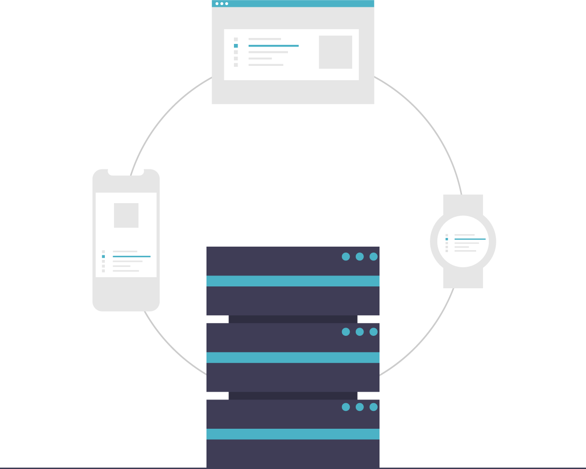

# Unix Environment Setup

**An overly thorough and opinionated guide to setting up a software engineering environment on Mac.**

<br>

## OVERVIEW

This guide covers the core technologies your computer will need for a software engineering environment. Briefly, let's overview all of the installations:

- Your Terminal Toolbox ([Command Line Tools]);
- Your Primary Package Manager ([Homebrew]);
- Your Terminal Shell ([Zsh] and the [Oh My Zsh] framework);
- Your Version Control Manager ([Git] and the necessary [Git Configurations]);
- Your Runtime Environment ([Node.js], as well as the version manager, [NVM], and the package manager, [NPM]);
- Your Database Management Programs ([PostgreSQL] and [MongoDB]);
- Your Backend Scripting Language ([Ruby], as well as the version manager, [Rbenv], and some packages, [Ruby Gems]); and
- Your GUI Applications.

In addition to these necessary installations, I provide some recommendations that will help you make the most of your coding environment, including:

- Your macOS Environment ([macOS Plugins]);
- Your Shell Environment ([Terminal Settings], [Zsh Plugins], and [Oh My Zsh Themes]);
- Your Integrated Development Environment ([VSCode Settings], [VSCode Extensions], and [VSCode Themes]); and finally,
- Your Browser Environment ([Google Chrome Extensions]).

Lastly, I'm including "detail" drop-downs like the following:

<details><summary>Click Me!</summary><br>

I will use these dropdowns to keep the guide relatively clean and focused, but to still include important details and context about what is happening with each download. I've used this **emoji key** to help with visual indicators:

- **⚠️ Warnings**
- **❗ Common Errors**
- **🔎 Learn More**

</details><br>

<br>

## Some Tips For Anyone New To Coding

Before you start, I recommend three things:

<details><summary>1) Familiarize Yourself With The Tools of the Trade</summary><br>

If you're _brand_ new to software engineering, or if you aren't particularly comfortable with your computer, shortcuts, and so forth, including the command line interface, please review the guide to [Tools of the Trade]. Even for experienced engineers, focusing on these more basic tools can **significantly level up one's coding prowess and productivity**.

</details>

<details><summary>2) Practice Researching Anything & Everything</summary><br>

With the vast complexities of software engineering, it is simply impossible to know and memorize **everything** you will need on a daily basis. Get used to Googling, it will make a huge difference. In this spirit, I've included links to documentation on all the software you'll need, and you can open up the [Glossary] in a new tab; if you have any questions or need to troubleshoot, use these to your advantage.

</details>

<details><summary>3) Be Thorough & Methodical</summary><br>

Finally, and perhaps most importantly, you **must** use methodical, step-by-step attention to detail. This is integral to a career in software engineering, but especially when setting up your laptop and coding environment. **Doing these steps out of order can have code-breaking implications**.

</details><br>

Let's dive in!

<br>

***

## INSTALLATIONS

This guide will be using **Terminal** for all installations.

> ⚠️ Warning: While installing, do not use the `sudo` command, unless specifically told to do so. `sudo`, meaning "Super User DO", often installs software in different locations on your hard drive, placing them in `root` instead of in your `user` directory. This can cause issues down the line.

Ready to get started? Let's open your terminal!

<br>

***

<br>

<div align="center">

</div>

### Your Terminal Toolbox: _Command Line Tools_

> [Xcode Documentation] | [Xcode Resources] | [Command Line Tools Downloads] 

Xcode is Apple's native Integrated Development Environment, or IDE. For the most part, you won't be using Xcode, unless/until you become more specialized in your career, but we _will_ be using a subset of the Xcode app, called the _Command Line Tools_ package. (If you have the full Xcode suite installed already, skip to the Verify Installation steps.)

<details><summary>📋 Installation Steps</summary><br>

**STEP 1.** Copy and paste the following script into your terminal.

```shell
xcode-select --install
```

**STEP 2.** Follow the GUI prompt to install the Command Line Tools. While installing, the prompt will show you a status bar and the approximate time remaining. If successfully installed, the prompt will tell you, "The software was installed." Click "Done".

</details> 

<details><summary>✅ Verify Installation</summary><br>

To confirm installation, run the command `xcode-select -v`. The output should state `xcode-select version 2400` or higher. To confirm installation location, run the command `xcode-select -p`. The output should state `/Library/Developer/CommandLineTools`.

</details>

<details><summary>❗ Common Errors</summary><br>

If Command Line Tools are already installed, you will receive `xcode-select: error: command line tools are already installed, use "Software Update" to install updates`. If Command Line Tools is installed at the wrong path, this may be intentional; if you have the full Xcode suite, the output should state `/Library/Developer/CommandLineTools`; if not, simply try running the following command to reset the path location.

```shell
xcode-select -r
```

</details>

<details><summary>🔎 Learn More</summary><br>

Clocking in at over 3GB, Xcode is a beast of an IDE, and we just don't need to use up that disk space. That said, we will use Command Line Tools, which is a package within Xcode. Command Line Tools includes the most commonly used utilities and compilers (_make_, _GNU compiler collection_, _perl_, _git_, etc.), and we will be needing these. In Terminal, Command Line Tools uses `xcode-select` command prefix.

</details>

<br>

[back to top ⤴️]

***

<br>

<div align="center">

</div>

### Your Primary Package Manager: _Homebrew_

> [Brew Documentation] | [Brew GitHub] | [Brew Issue Tickets]

Homebrew is a _package manager_ for macOS. Many of the software packages you will need for the Unix dev environment will be installed and maintained via Homebrew.

<details><summary>📋 Installation Steps</summary><br>

**STEP 1.** Copy and paste the following script into your terminal.

```shell
/bin/bash -c "$(curl -fsSL https://raw.githubusercontent.com/Homebrew/install/HEAD/install.sh)"
```

**STEP 2.** You should be prompted with `==> Checking for 'sudo' access (which may request your password).` You'll see a new line with a blinking key icon. Enter your Admin password.

> ⚠️ As you type, your cursor will not move and your typing won't be visible– simply type your full password and hit enter.

**STEP 3.** Next, you should be prompted with `==> This script will install: ...` and `==> The following new directories will be created: ...`, listing a series of file-folder paths, followed by `Press RETURN to continue or any other key to abort`. Press RETURN.

> ⚠️ While Homebrew is still installing, you won't be able to use your bash command line prompt. You should see multiple processes running.

If successfully installed, you will see a large message that begins with `==> Installation successful!`.

**STEP 4.** While Homebrew is now installed, we now have to instruct our terminal to acknowledge `brew` commands. We do this by configuring our shell with a path update. Copy and paste the following script, replacing `[username]` with your laptop's username, into your terminal.

```shell
echo >> /Users/[username]/.zprofile
echo 'eval "$(/opt/homebrew/bin/brew shellenv)"' >> /Users/[username]/.zprofile
eval "$(/opt/homebrew/bin/brew shellenv)"
```

</details>

<details><summary>✅ Verify Installation</summary><br>

To confirm, run the command `brew -v`. The output should state `Homebrew 4.4.16` or higher.

</details>

<details><summary>❗ Common Errors</summary><br>

It's highly unlikely that this will error out. Even when it's already installed, Homebrew will take the opportunity to install a clean version and update any outdated dependencies.

</details>

<details><summary>🔎 Learn More</summary><br>

Homebrew is a _package manager_, meaning, it provides software packages and can handle safely updating and uninstalling as needed. Homebrew is considered essential for core software which macOS doesn't ship natively, but which are necessary for your work. Homebrew packages are divided into **formulae**, **casks**, **taps**, or **bottles**; for the time being, we'll really only be using formulae and casks. _Formulae_ are for softwares that you'll only interact with through the terminal– meaning, software that doesn't have an "app" interface in the GUI (i.e.: Node). _Casks_ are for softwares that you interact with in your GUI, such as Safari or Chrome.

In terminal, Homebrew utilizes the `brew` command prefix.

</details>

<br>

[back to top ⤴️]

***

<br>
<div align="center">

</div>

### Your Terminal Shell: _Zsh_

> [Zsh Documentation] | [Zsh Users Project]

Zsh, pronounced by the acronym Z-S-H, is a Unix _shell_ and command interpreter for shell scripting. It serves as a replacement for _Bash_, the default Unix Terminal shell.
 
<details><summary>📋 Installation Steps</summary><br>

**STEP 1.** Copy and paste the following Homebrew command in your terminal.

```shell 
brew install zsh
```

If Zsh was successfully installed, you will see a large message that begins with `==> Installation successful!`.

**STEP 2.** Copy and paste the following script to make Zsh your default Terminal shell.

```shell
chsh -s /usr/local/bin/zsh
```

**STEP 3.** If prompted, enter your password.

> ⚠️ Remember, as you type, your cursor will not move and your typing won't be visible– simply type your full password and hit enter.

**STEP 4.** Quit your terminal application and restart it to open your Z shell. 

> ⚠️ You must "hard quit" Terminal– do not just close the window!

</details>

<details><summary>✅ Verify Installation</summary><br>

To confirm installation, run the command `zsh --version`. The output should be `zsh 5.9` or higher.

To confirm Zsh has been made your default shell, run `echo $SHELL`. The output should be `bin/zsh`.

If this is not the case, view the next section, _Common Errors_.

</details>

<details><summary>❗ Common Errors</summary><br>

If Zsh is already installed, Homebrew will take the opportunity to upgrade any Brew packages before returning:

```shell
Warning: zsh <version> is already installed and up-to-date.
To reinstall <version>, run:
  brew reinstall zsh
```

If running `echo $SHELL` returned `bin/bash`, this means your default shell has not changed. First, try hard-quitting your terminal. (Do not simply close the Terminal window. This doesn't quit the application. Use _command + Q_ to quit.) Once it has quit, reopen terminal and re-run `echo $SHELL`. This should fix the issue.

</details>

<br>

### Your Shell Framework: _Oh My Zsh_

> [Oh My Zsh Documentation] | [Oh My Zsh Github] | [Oh My Zsh Issue Tickets]

Oh My Zsh is a community-driven framework for Zsh. It helps us customize and configure our shell.

<details><summary>📋 View Installation Steps</summary><br>

**STEP 1.** Copy and paste the following command in your terminal.

```shell
sh -c "$(curl -fsSL https://raw.githubusercontent.com/ohmyzsh/ohmyzsh/master/tools/install.sh)"
```

If Oh My Zsh is successfully installed, you'll see a large message containing:

```shell
         __                                     __
  ____  / /_     ____ ___  __  __   ____  _____/ /_
 / __ \/ __ \   / __ `__ \/ / / /  /_  / / ___/ __ \
/ /_/ / / / /  / / / / / / /_/ /    / /_(__  ) / / /
\____/_/ /_/  /_/ /_/ /_/\__, /    /___/____/_/ /_/
                        /____/                       ....is now installed!
```

</details>

<br>

[back to top ⤴️]

***

<br>
<div align="center">

</div>

### Your Version Control Manager: _Git_

> [Git Documentation] | [Git on Github]

_Git_ is a free, open-source _version control system_– meaning, it allows teams to collaborate on code that's stored safely in cloud– and comes with built-in tools for avoiding code conflicts.

<details><summary>📋 Installation Steps</summary><br>

**STEP 1.** Run the following Homebrew command in your terminal:

```shell
brew install git
```

If successful, you should see multiple Brew installations (the dependencies for the Git software).

</details>

<details><summary>✅ Verify Installation</summary><br>

To confirm, run `git --version`. The output should be `git version 2.39.5 (Apple Git-154)` or higher.

</details>

<details><summary>🔎 Learn More</summary><br>

Git version control is the lifeblood of the software engineer. It's nearly universally used on all projects and by all companies, because it's a lightweight, open-source, cloud-based approach to collaborative, conflict-free coding. Note, _Git_ is not the same as _GitHub_– Git is the _version control system_, whereas GitHub is one of many Git-based project hosting websites. (A comparable analogy is an _Img_ file and the _Imgur_ website– Imgur hosts images, but an _Img_ and _Imgur_ are very different things.)

</details>

<br>

### Your VCS Configurations

We're not done just yet with Git– in order for your computer to utilize your Git correctly, including communicating and syncing with your cloud-based Git repositories, it's highly important that we set up certain Git _configurations_ for your _global environment_.

#### Authorship Information

<details><summary>📋 Steps</summary><br>

**STEP 1.** Run the following command, replacing the name and email address with your own information. (The email should correspond with your personal GitHub account.)

```shell
git config --global user.name "Misha Kessler"
git config --global user.email "misha.kessler@gmail.com"
```

</details>

<details><summary>🔎 Learn More</summary><br>

For you to receive "credit" for your work, your Git configuration includes your "author information", such as your name and email address. Each time you make a commit to your Git repository, the commit includes this authorship information on the commit details; this enables GitHub to link and credit your commits to your GitHub profile. By default, your authorship name is the name of your macOS user account, and the email is often that name at your "local" email– for example, `misha@mishasmacbookpro.local`. Obviously, this needs to be updated to ensure your commits are documented correctly.

</details>

#### Default Editor

<details><summary>📋 Steps</summary><br>

**STEP 1.** Run the following command.

```shell
git config --global core.editor "code --wait"
```

</details>

<details><summary>🔎 Learn More</summary><br>
  
Occasionally, Git will need to open documents in a code editor, or IDE. By default, the editor used is Vim, a rather confusing interface for novice software engineers. Instead, we'll tell Git to open in our default editor, VS Code. (Visual Studio does not need to be installed yet, in order to set up this configuration. We'll cover the installation later in this guide!)

</details>

#### Branch Naming Convention

<details><summary>📋 View Steps</summary><br>

**STEP 1.** Run the following command.

```shell
git config --global init.defaultBranch main
```

</details>

<details><summary>🔎 Learn More</summary><br>
  
If you're new to Git, it handles multiple versions of the same document by creating "branches," and software engineers have strong naming conventions and preferences for these branches. Previously, the conventional name for the main branch was `master` branch, but convention has moved away from this name due to its foundation in the language of oppression ("master" and "slave" dynamics). Now, Git recommends replacing `master` with `main`, but we still need to tell our system to start all projects with this name.

</details>

#### Rebase Convention

<details><summary>📋 Steps</summary><br>

**STEP 1.** Run the following command.

```shell
git config --global pull.rebase false
```

</details>

<details><summary>🔎 Learn More</summary><br>
  
Rebasing in Git is a tool for integrating changes across versions. Rebasing is a "dangerous" git operation because it alters the Git history– a cardinal sin when used inappropriately– and occassionally, when dealing with complex git flows, you may be prompted to set your default "pull action." (Don't worry– you'll learn what all of this means soon enough.) Until you understand rebasing, we want to squash that warning by turning off automatic rebasing.

</details>

#### GitHub

<details><summary>📋 Steps</summary><br>

**STEP 1.** Run the following Homebrew command.

```shell
brew install gh
```

</details>

<details><summary>🔎 Learn More</summary><br>
  
As discussed above, _Git_ and _GitHub_ are different; this CLI package from GitHub allows us to use the `gh` command to interact with our repositories.

</details>

#### GitHub Credential Management

<details><summary>📋 Steps</summary><br>

**STEP 1.** Run the following command.

```shell
brew install --cask git-credential-manager
```

**STEP 2.** The next time you run a command that requires a secure Git transaction over HTTPS, your CLI will lead you through a process for logging into GitHub. If you'd like to start the process now, try cloning this glossary for novice software engineers:

```shell
gh install --cask git-credential-manager
```

</details>

<details><summary>🔎 Learn More</summary><br>

For you to have full control over your Git repositories from your Terminal, we need to set a secure connection to GitHub, giving your Git-based commands the proper permissions to be executed, and GPG tools, allowing your commits to be verified locally.

</details>

<br>

<details><summary>✅ Verify Configurations</summary><br>

To confirm these configurations are correct, run `git config list`. The output should list all the information we've entered, similar to the following: 

```shell
credential.helper=osxkeychain
user.name=[name]
user.email=[email]
core.editor=code --wait
init.defaultbranch=main
pull.rebase=false
credential.helper=/usr/local/share/gcm-core/git-credential-manager
credential.https://dev.azure.com.usehttppath=true
```

</details>

<br>

[back to top ⤴️]

***

<br>
<div align="center">

</div>

### Your JavaScript Runtime Environment: _Node_

_Node_ is an open-source, cross-platform _JavaScript_ runtime environment. Before we discuss Node, we'll want to cover _Node Version Manager_, our software of choice for managing our Node installations.

#### Node Version Manager

> [NVM on GitHub] | [NVM Troubleshooting] | [NVM Issue Tickets]

<details><summary>📋 Installation Steps</summary><br>

**STEP 1.** Copy and paste the following script into your terminal.

```shell
curl -o- https://raw.githubusercontent.com/nvm-sh/nvm/v0.40.1/install.sh | bash
```

**STEP 2.** You should be prompted with a confirmation message, such as `==> Installation successful!`. If so, we no have to instruct our terminal to load NVM and acknowledge our commands. Copy and paste the following script into your terminal.

```shell
export NVM_DIR="$([ -z "${XDG_CONFIG_HOME-}" ] && printf %s "${HOME}/.nvm" || printf %s "${XDG_CONFIG_HOME}/nvm")"
[ -s "$NVM_DIR/nvm.sh" ] && \. "$NVM_DIR/nvm.sh"
```

</details>

<details><summary>✅ Verify Installation</summary><br>

To confirm, run the command `nvm -v`. The output should state `0.40.1` or higher.

</details>

<details><summary>🔎 Learn More</summary><br>

NVM is one of a few available Node _version managers_, meaning, it provides can handle safely installing, updating, setting local or global versions, and uninstalling Node versions as needed. In terminal, NVM utilizes the `nvm` command prefix.

</details>

#### Node & Node Package Manager

> [Node Website] | [Node Documentation] | [Node on GitHub] | [Node Issue Tickets]

<details><summary>📋 Installation Steps</summary><br>

**STEP 1.** With NVM installed, now copy and paste the following script into your terminal.

```shell
nvm install 23
```

</details>

<details><summary>✅ Verify Installation</summary><br>

Following Step 1, you should be prompted with a confirmation message, such as `Now using node v23.6.0 (npm v10.9.2)`. To confirm, run the commands `nvm current` and `node -v`. Both should output `v23.6.0` or higher.

</details>

#### Yarn

> [Yarn Website] | [Yarn Documentation] | [Yarn on GitHub] | [Yarn Issue Tickets]

<details><summary>📋 Installation Steps</summary><br>

**STEP 1.** While Node also installed _Node Package Manager_, we're going to use an alternative to NPM called _Yarn_. (This can boil down to personal preference, but I'm a fan of Yarn.) Copy and paste the following command into your terminal.

```shell
corepack enable yarn
```

**STEP 2.** Following Step 1, you won't receive a confirmation message. Nexxt, run the command `yarn -v`. You will be prompted with the following message: 

```shell
! Corepack is about to download https://registry.yarnpkg.com/yarn/-/yarn-1.22.22.tgz
? Do you want to continue? [Y/n]
```

**STEP 3.** Press `y` and `return`. 

</details>

<details><summary>✅ Verify Installation</summary><br>

Following Step 3, you should see the output from your `yarn -v` command; the version should be `1.22.22` or higher.

</details>


#### JavaScript Add-Ons

<br>

##### TypeScript

[TypeScript Website] | [TypeScript Documentation] | [TypeScript GitHub] | [TypeScript Issue Tickets]


<details><summary>🔎 Learn More</summary><br>
</details>

<details><summary>📋 View Steps</summary><br>
</details>

<br>

[back to top ⤴️]

***

<br>
<div align="center">

</div>

### Your Database Management Programs

<br>

#### PostgreSQL

[PostgreSQL Website] | [PostgreSQL Documentation] | [PostgreSQL GitHub] | [PostgreSQL Issue Tickets]


<br>

#### MongoDB

[MongoDB Website] | [MongoDB Documentation] | [MongoDB GitHub] | [MongoDB Issue Tickets]


<br>

[back to top ⤴️]

***

<br>
<div align="center">

</div>

### Your Backend Scripting Language

<br>

#### Rbenv

<br>

#### Ruby

<br>

#### Ruby Gems

<br>

##### Pry

<details><summary>🔎 Learn More</summary><br>
</details>

<details><summary>📋 View Steps</summary><br>
</details>

<br>

##### Rspec

<details><summary>🔎 Learn More</summary><br>
</details>

<details><summary>📋 View Steps</summary><br>
</details>

<br>

##### Rails

<details><summary>🔎 Learn More</summary><br>
</details>

<details><summary>📋 View Steps</summary><br>
</details>


<br>

[back to top ⤴️]

***

<br>
<div align="center">

</div>

### Your GUI Applications

<br>

#### Google Chrome

<br>

#### iTerm2

<br>

#### Visual Studio Code

<br>

#### PostMan

<br>

[back to top ⤴️]

***
***

<br>

## CUSTOMIZATIONS

<br>

***

<br>
<div align="center">

</div>

### Your macOS Environment

<br>

#### macOS Plugins

<br>

##### Magnet

<details><summary>🔎 Learn More</summary><br>
</details>

<details><summary>📋 View Steps</summary><br>
</details>

<br>

<br>

[back to top ⤴️]

***

<br>
<div align="center">

</div>

### Your Shell Environment

<br>

#### Terminal Settings

<br>

#### Zsh Plugins

<br>

##### Zsh Completions

<details><summary>🔎 Learn More</summary><br>
</details>

<details><summary>📋 View Steps</summary><br>
</details>

<br>

#### Oh My Zsh Themes

<br>

[back to top ⤴️]

***

<br>
<div align="center">

</div>

### Your Integrated Development Environment

<br>

#### VSCode Settings

<br>

#### VSCode Extensions

<br>

##### Bracket Pair Colorizer

<details><summary>🔎 Learn More</summary><br>
</details>

<details><summary>📋 View Steps</summary><br>
</details>

<br>

##### Indent Rainbow 

<details><summary>🔎 Learn More</summary><br>
</details>

<details><summary>📋 View Steps</summary><br>
</details>

<br>

#### VSCode Themes

##### Color Themes

<details><summary>🔎 Learn More</summary><br>
</details>

<details><summary>📋 View Steps</summary><br>
</details>

<br>

##### Icon Themes

<details><summary>🔎 Learn More</summary><br>
</details>

<details><summary>📋 View Steps</summary><br>
</details>

<br>

[back to top ⤴️]

***

<br>
<div align="center">

</div>

### Your Browser Environment

<br>

#### Google Chrome Extensions

<br>

##### React Dev Tools

<details><summary>🔎 Learn More</summary><br>
</details>

<details><summary>📋 View Steps</summary><br>
</details>

<br>

##### Color Picker

<details><summary>🔎 Learn More</summary><br>
</details>

<details><summary>📋 View Steps</summary><br>
</details>

<br>

##### JSON Viewer

<details><summary>🔎 Learn More</summary><br>
</details>

<details><summary>📋 View Steps</summary><br>
</details>


<br>

[back to top ⤴️]

***

<!-- Links -->
[Guide to Determining Your Environment]: https://github.com/mishakessler/determine-your-environment
[Unix Version]: https://github.com/mishakessler/unix-environment
[M1 Version]: https://github.com/mishakessler/m1-environment
[Linux Version]: https://github.com/mishakessler/linux-environment
[Tools of the Trade]: https://github.com/mishakessler/tools-of-the-trade
[Glossary]: https://github.com/mishakessler/glossary

[Your Terminal Toolbox]: #your-terminal-toolbox
[Command Line Tools]: #command-line-tools
[Command Line Tools Instructions]: https://osxdaily.com/2014/02/12/install-command-line-tools-mac-os-x/
[Command Line Tools Downloads]: https://developer.apple.com/download/more/?=command%20line%20tools
[Xcode Documentation]: https://developer.apple.com/documentation/xcode/
[Xcode Resources]: https://developer.apple.com/xcode/resources/

[Your Primary Package Manager]: #your-primary-package-manager
[Homebrew]: #homebrew
[Brew Website]: https://brew.sh/
[Brew Documentation]: https://docs.brew.sh/
[Brew GitHub]: https://github.com/Homebrew/
[Brew Issue Tickets]: https://github.com/Homebrew/brew/issues

[Your Terminal Shell]: #your-terminal-shell
[Zsh]: #zsh
[Zsh Website]: http://zsh.sourceforge.net/
[Zsh Documentation]: http://zsh.sourceforge.net/Doc/Release/zsh_toc.html
[Zsh Users Project]: https://github.com/zsh-users
[Oh My Zsh]: #oh-my-zsh
[Oh My Zsh Website]: https://ohmyz.sh/
[Oh My Zsh Documentation]: https://docs.OhMyZsh.sh/
[Oh My Zsh GitHub]: https://github.com/ohmyzsh/
[Oh My Zsh Issue Tickets]: https://github.com/ohmyzsh/ohmyzsh/issues

[Your Version Control Manager]: #your-version-control-manager
[Git]: #git
[Git Website]: https://git-scm.com/
[Git Documentation]: https://git-scm.com/doc
[Git on Github]: https://github.com/git/git
[Git Configurations]: #git-configurations

[Your Frontend Scripting Language]: #your-frontend-scripting-language
[NVM]: #nvm
[NVM on GitHub]: https://github.com/nvm-sh/nvm
[NVM Troubleshooting]: https://github.com/nvm-sh/nvm#troubleshooting-on-macos
[NVM Issue Tickets]: https://github.com/nvm-sh/nvm/issues

[Node.js]: #nodejs
[Node Website]: https://nodejs.org/en/
[Node Documentation]: https://nodejs.org/en/docs/guides/
[Node on GitHub]: https://github.com/nodejs/node
[Node Issue Tickets]: https://github.com/nodejs/node/issues

[NPM]: #npm
[Yarn Website]: https://yarnpkg.com/
[Yarn Documentation]: https://yarnpkg.com/getting-started
[Yarn on GitHub]: https://github.com/yarnpkg/
[Yarn Issue Tickets]: https://github.com/yarnpkg/yarn/issues

[JavaScript Add-Ons]: #javascript-add-ons
[TypeScript]: #typescript
[TypeScript Website]: https://www.typescriptlang.org/
[TypeScript Documentation]: https://www.typescriptlang.org/docs/
[TypeScript GitHub]: https://github.com/microsoft/TypeScript
[TypeScript Issue Tickets]: https://github.com/microsoft/TypeScript/issues

[Your Database Management Programs]: #your-database-management-programs
[PostgreSQL]: #postgresql
[PostgreSQL Website]: #
[PostgreSQL Documentation]: #
[PostgreSQL GitHub]: #
[PostgreSQL Issue Tickets]: #

[MongoDB]: #mongodb
[MongoDB Website]: #
[MongoDB Documentation]: #
[MongoDB GitHub]: #
[MongoDB Issue Tickets]: #

[Your Backend Scripting Language]: #your-backend-scripting-language
[Rbenv]: #rbenv
[Ruby]: #ruby
[Ruby Gems]: #ruby-gems
[Pry]: #pry
[Rspec]: #rspec
[Rails]: #rails

[Your GUI Applications]: #your-gui-applications
[Google Chrome]: #google-chrome
[Visual Studio Code]: #visual-studio-code
[PostMan]: #postman

[Your macOS Environment]: #your-macos-environment
[macOS Plugins]: #macos-plugins
[Magnet]: #magnet

[Your Shell Environment]: #your-shell-environment
[Terminal Settings]: #terminal-settings
[Zsh Plugins]: #zsh-plugins
[Zsh Completions]: #zsh-completions
[Oh My Zsh Themes]: #oh-my-zsh-themes

[Your Integrated Development Environment]: #your-integrated-development-environment
[VSCode Settings]: #vscode-settings
[VSCode Extensions]: #vscode-extensions
[Bracket Pair Colorizer]: #bracket-pair-colorizer
[VSCode Themes]: #vscode-themes
[Color Themes]: #color-themes
[Icon Themes]: #icon-themes

[Your Browser Environment]: #your-browser-environment
[Google Chrome Extensions]: #google-chrome-extensions
[React Dev Tools]: #react-dev-tools
[Color Picker]: #color-picker
[JSON Viewer]: #json-viewer

[back to top ⤴️]: #table-of-contents
